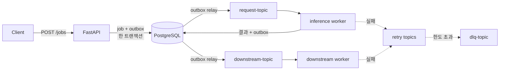

# MorphFlow

Kafka 이벤트 기반 AI 추론 파이프라인.
병목 위치에 따라 같은 코드베이스를 A/B/C/BC 구조로 전환하고, 재시도·워커 장애·중복 전달이
겹쳐도 작업 상태가 어긋나거나 메시지가 유실되지 않도록 하는 데 초점을 둔다.

> 추론은 실제 GPU 대신 **시뮬레이터**로 돌린다([ADR-0006](docs/decisions/ADR-0006-gpu-inference-simulator.md)).
> 동시 실행 제한·지연·실패율·마이크로배치를 통제해 병목을 재현 가능하게 만들기 위한 선택이며,
> 실제 모델로 교체하는 지점은 `build_primary_processor()` 한 곳이다.

## 핵심 설계

| 문제 | 해결 | 위치 |
|---|---|---|
| 재시도 백오프를 `sleep` 으로 기다리면 poll 이 멈춰 리밸런스가 난다 | `retry-at` 헤더만 싣고, 때가 안 된 메시지는 **해당 파티션만** pause | `app/workers/runner.py` |
| 실패한 메시지의 커밋만 건너뛰면 컨슈머 위치가 이미 지나가 유실된다 | **성공한 접두부까지만** 커밋하고 실패 지점으로 seek | `app/workers/runner.py` |
| lease 만료·재시도로 두 워커가 같은 job 을 잡으면 결과를 덮어쓴다 | 허용된 출발 상태를 `WHERE` 에 건 **조건부 UPDATE(CAS)** | `app/domain/models.py`, `app/adapters/db/repositories.py` |
| 인계 후에도 상태는 `PROCESSING` 이라 옛 소유자의 쓰기가 CAS 를 통과한다 | lease 선점마다 증가하는 `lease_epoch` **펜싱 토큰** | `app/adapters/db/repositories.py` |
| DB 커밋과 Kafka 발행이 한 트랜잭션에 묶이지 않는다 | **트랜잭셔널 아웃박스** + `FOR UPDATE SKIP LOCKED` 릴레이 | `app/adapters/messaging/outbox_relay.py` |

각 항목의 배경과 한계는 [상태 정합성과 발행 보장](#3-상태-정합성과-발행-보장),
[Retry / DLQ](#4-retry--dlq-운영) 절에 있다.

## 구조

C 모드 기준 흐름. A 모드는 inference·downstream 을 한 워커가 처리하고,
B 모드는 추론만, C 모드는 후단 처리까지 분리한다. 모드는 `ARCHITECTURE_MODE`·`WORKER_ROLE`
환경 변수로 바꾸며 API 계약·상태 모델·스키마·지표 이름은 모드와 무관하게 고정한다
([ADR-0001](docs/decisions/ADR-0001-transitional-architecture-modes.md)).



## 1. 빠른 시작

기본(A 모드):
```bash
docker compose -f docker-compose.dev.yml --env-file env/.env.dev up -d --build
```

Observability:
```bash
docker compose -f deploy/observability-compose.yml up -d
```

## 2. 아키텍처 모드 실행

### A 모드 (기본)
- API -> `request-topic` -> unified worker
- 실행:
```bash
docker compose -f docker-compose.dev.yml --env-file env/.env.dev up -d --build
```

### B 모드 (추론 분리)
- API -> `request-topic` -> inference worker
- processor backend 기본값: `simulator` (`WORKER_PROCESSOR_BACKEND`)
- 실행:
```bash
docker compose -f docker-compose.dev.yml -f deploy/docker-compose.bmode.override.yml --env-file env/.env.dev up -d --build
```

### C 모드 (downstream 분리)
- API -> `request-topic` -> inference worker -> `downstream-topic` -> downstream worker
- 실행:
```bash
docker compose -f docker-compose.dev.yml -f deploy/docker-compose.cmode.override.yml --env-file env/.env.dev up -d --build
```

### 핵심 엔드포인트

- `POST /jobs`
- `GET /jobs/{job_id}`
- `GET /health/live`
- `GET /health/ready`
- `GET /metrics`

## 3. 상태 정합성과 발행 보장

### 조건부 상태 전이 (CAS)

`jobs.status` 갱신은 전부 조건부 UPDATE 로만 한다. 허용된 출발 상태를 `WHERE` 에
걸고, 바뀐 행이 없으면 경쟁에서 밀린 것으로 보고 그대로 종료한다.

```
PENDING    -> PROCESSING, FAILED
PROCESSING -> SUCCESS, FAILED, PROCESSING
SUCCESS    -> (종착)
```

읽고-바꾸고-쓰는 방식이던 때는, lease 만료나 재시도로 같은 job 을 두 워커가
잡으면 늦게 끝난 쪽이 앞선 결과를 덮어썼다. 성공한 작업이 FAILED 로 기록되는
일이 여기서 나온다. 밀린 전이는 `job_transition_conflict_total` 로 센다.

### 작업 소유권 (lease + 펜싱 토큰)

작업 선점은 Redis SETNX 가 아니라 `jobs` 행의 lease 로 한다. Redis TTL 방식은
TTL 이 만료되는 순간 두 워커가 같은 job 을 동시에 처리하는 것을 막지 못했고,
뒤늦게 끝난 쪽이 인계받은 워커의 결과를 덮어썼다.

- 선점: `PENDING`/`FAILED` 이거나 lease 가 만료된 `PROCESSING` 일 때만 성공.
  성공하면 `lease_epoch` 가 1 증가한다(펜싱 토큰)
- 결과 기록: `WHERE lease_owner = ? AND lease_epoch = ?` 를 함께 건다.
  소유권을 빼앗긴 워커의 쓰기는 조건에서 탈락한다
- 회수: lease 만료는 앞선 워커가 죽은 것으로 본다 (`job_lease_takeover_total`)
- 살아 있는 lease 를 만나면 `LEASE_HELD` 로 재시도 경로에 넘긴다

상태 조건(CAS)만으로는 부족하다. 인계 직후 상태는 여전히 `PROCESSING` 이라
옛 소유자의 `SUCCESS` 쓰기가 상태 조건은 통과하기 때문이다. 이를 막는 것은
epoch 비교뿐이다.

lease 만료 판정에는 각 워커의 시계를 쓴다. 워커 간 시계가 크게 어긋나면
회수 시점이 흔들리므로 NTP 동기화를 전제한다.

### 트랜잭셔널 아웃박스

DB 와 Kafka 는 한 트랜잭션에 묶이지 않는다. 그래서 발행할 메시지를 상태 변경과
**같은 트랜잭션**에 `outbox_messages` 로 적재하고, 릴레이가 커밋된 행을 읽어
Kafka 로 내보낸다.

- 커밋 직후 프로세스가 죽어도 행이 `PENDING` 으로 남아 다음 주기에 나간다
- 발행 실패 시 상태를 바꾸지 않고 `attempts` 만 올려 재시도한다
- 배치 중간이 실패하면 뒤 메시지를 먼저 보내지 않아 순서가 뒤집히지 않는다
- 릴레이가 여러 개 떠도 `FOR UPDATE SKIP LOCKED` 로 같은 행을 집지 않는다

전달 보장은 at-least-once 다. 같은 메시지가 두 번 나갈 수 있으므로 소비 측
멱등 처리(작업 선점 CAS, Redis 예약)가 함께 있어야 한다.

관련 설정: `OUTBOX_RELAY_BATCH_SIZE`, `OUTBOX_RELAY_POLL_INTERVAL_SECONDS`
관련 메트릭: `outbox_published_total`, `outbox_publish_failure_total`,
`outbox_pending_backlog`

마이그레이션: `alembic upgrade head` (revision `20260913_0002`)

## 4. Retry / DLQ 운영

### 토픽
- `request-topic`
- `retry-topic` (request/inference retry)
- `retry-downstream-topic` (downstream retry)
- `dlq-topic`

### 헤더
- `retry-count`
- `original-topic`
- `error-reason`
- `retry-at` — 이 시각(epoch ms) 전에는 처리하지 않는다

### 백오프 처리

백오프를 컨슈머 루프에서 `sleep` 으로 기다리면 그동안 poll 이 멈춘다. 지연이
길어지면 `max_poll_interval_ms` 를 넘겨 리밸런스가 나고, 같은 컨슈머가 맡은
다른 파티션까지 함께 멈춘다.

그래서 재시도 메시지는 지연 없이 바로 발행하고 `retry-at` 만 실어 보낸다.
소비 쪽에서 아직 때가 되지 않은 메시지를 만나면 offset 을 되돌리고 그
**파티션만** 일시 정지시킨다. 시각이 지나면 자동으로 재개한다.
(`retry_deferred_total`)

### 오프셋 커밋

파티션끼리는 병렬로, 한 파티션 안에서는 순서대로 처리한다. 배치 전체를
한꺼번에 처리하면 같은 파티션의 순서가 뒤집혀 상태 전이가 어긋난다.

커밋은 **성공한 접두부까지만** 한다. 중간에서 실패하면 그 지점으로 seek 해
다음 poll 에서 다시 읽는다. 커밋만 건너뛰던 때는 컨슈머 위치가 이미 전진한
뒤라 실패한 메시지를 영영 보지 못했다.

### 정책
- retry backoff: exponential
- `RETRY_MAX_COUNT` 초과 시 DLQ 전송
- DLQ는 원본 payload 유지

### Inference Simulator 설정
- `WORKER_PROCESSOR_BACKEND=simulator|dummy`
- `INFERENCE_MAX_CONCURRENCY`
- `INFERENCE_SIMULATED_LATENCY_MS`
- `INFERENCE_SIMULATED_FAILURE_RATE`
- `INFERENCE_SIMULATED_GPU_UTILIZATION`

관련 메트릭:
- `inference_processing_seconds`
- `inference_semaphore_wait_seconds`
- `inference_active_jobs`
- `inference_simulated_gpu_utilization`
- `inference_simulated_failure_total`

### DLQ 확인/재처리
```bash
# DLQ 확인
docker exec -it $(docker compose -f docker-compose.dev.yml ps -q kafka) \
  /opt/kafka/bin/kafka-console-consumer.sh \
  --bootstrap-server kafka:9092 \
  --topic dlq-topic \
  --from-beginning

# 원인 수정 후 재주입
docker exec -i $(docker compose -f docker-compose.dev.yml ps -q kafka) \
  /opt/kafka/bin/kafka-console-producer.sh \
  --bootstrap-server kafka:9092 \
  --topic request-topic
```

## 5. Observability 구조

### 구성
- Metrics: Prometheus
- Dashboard: Grafana
- Tracing: OpenTelemetry -> Jaeger
  - FastAPI request span
  - aiokafka producer/consumer span
  - SQLAlchemy query span
  - Redis command span
- Logs: Fluent Bit -> Elasticsearch -> Kibana (EFK)
- Exporters: kafka/redis/postgres

### 접속
- Prometheus: `http://localhost:9091`
- Grafana: `http://localhost:3000`
- Jaeger: `http://localhost:16686`
- Elasticsearch: `http://localhost:9200`
- Kibana: `http://localhost:5601`

### 점검 명령
```bash
curl -s http://localhost:9091/api/v1/targets | jq '.data.activeTargets[] | {job: .labels.job, health: .health}'
curl -s http://localhost:9091/api/v1/rules | jq '.data.groups[] | {group: .name, rules: [.rules[].name]}'
curl -s "http://localhost:9200/morphflow-*/_search?size=1&sort=@timestamp:desc" | jq '.hits.hits[0]._source'
```

## 6. 테스트 실행

전체 핵심 테스트:
```bash
uv run --extra dev pytest -q
```

C 경로 시나리오 테스트:
```bash
uv run --extra dev pytest -q tests/test_c_architecture_flow.py
```

## 7. 마이그레이션

적용:
```bash
alembic upgrade head
```

롤백:
```bash
alembic downgrade -1
```

## 8. Kubernetes(Kind) 배포

### 범위
- 1차 범위: `api`, `worker`, `postgres`, `redis`, `kafka`, `migrate job`
- 경로: `deploy/k8s/base`
- 진입: NodePort `30081` (기본 호스트 `18000`으로 매핑)
- override 대응: `deploy/k8s/overlays/{bmode,cmode,bcmode}`
- observability: `deploy/k8s/overlays/observability` (Prometheus/Grafana/Jaeger/exporters)

### 실행 순서
```bash
# 1) kind 클러스터 생성
scripts/kind-create-cluster.sh local-dev

# 2) 앱 이미지 빌드
docker build -t morphflow-app:kind .

# 3) kind 노드로 이미지 로드
scripts/kind-load-images.sh local-dev

# 4) 기본(A) 배포 (migrate 생략)
scripts/k8s-deploy-kind.sh local-dev base
```

검증:
```bash
curl -s http://localhost:18000/health/live
curl -s http://localhost:18000/health/ready
```

마이그레이션이 필요한 경우(스키마 변경 시점):
```bash
scripts/k8s-deploy-kind.sh local-dev base --with-migrate
```

아키텍처 모드 overlay:
```bash
# B 모드
scripts/k8s-deploy-kind.sh local-dev bmode

# C 모드 (downstream-worker 포함)
scripts/k8s-deploy-kind.sh local-dev cmode

# BC 모드 (downstream-worker 포함)
scripts/k8s-deploy-kind.sh local-dev bcmode
```

Observability overlay:
```bash
kubectl apply -k deploy/k8s/overlays/observability --context kind-local-dev
```

HPA 확인:
```bash
kubectl get hpa -n morphflow --context kind-local-dev
```

참고: HPA 동작을 위해 cluster에 `metrics-server`가 필요하다.

주요 접속(NodePort):
- Grafana: `http://localhost:30300`
- Prometheus: `http://localhost:30901`
- Jaeger UI: `http://localhost:30686`

Networking overlay (MetalLB + Envoy Gateway + HTTPRoute):
```bash
kubectl apply -k deploy/k8s/overlays/networking --context kind-local-dev
```

또는 자동 대역 반영 + 적용:
```bash
make net-apply K8S_CONTEXT=kind-local-dev KIND_NETWORK=kind
```

상세 설치/검증 가이드:
- `deploy/k8s/overlays/networking/README.md`

포트 충돌 시:
```bash
HOST_API_PORT=28000 scripts/kind-create-cluster.sh local-dev
```

Compose에서 Kind로 옮긴 배경과 기록:
- [ADR-0005](docs/decisions/ADR-0005-kind-based-local-kubernetes.md)
- [TASK-20260317-21](docs/tasks/completed/TASK-20260317-21-compose-to-kind.md)

## 9. 문서

- [문서 안내](docs/README.md): 문서 종류별 기준 위치
- [아키텍처](docs/architecture/README.md): 현재 구성, 런타임 흐름, 배포, 기술 부채
- [아키텍처 결정 기록(ADR)](docs/decisions/README.md)
- [API·이벤트·DB 명세](docs/specs/README.md)
- [운영](docs/operations/README.md): 모니터링, 장애 대응
- 런북: [Kafka consumer lag](docs/operations/runbooks/RUNBOOK-kafka-consumer-lag.md),
  [재시도·DLQ 급증](docs/operations/runbooks/RUNBOOK-retry-dlq-surge.md),
  [워커 처리 지연](docs/operations/runbooks/RUNBOOK-worker-processing-delay.md),
  [downstream 병목](docs/operations/runbooks/RUNBOOK-downstream-bottleneck.md),
  [DB 지연](docs/operations/runbooks/RUNBOOK-database-latency.md),
  [Redis 장애](docs/operations/runbooks/RUNBOOK-redis-outage.md),
  [배치 튜닝 롤백](docs/operations/runbooks/RUNBOOK-batch-tuning-rollback.md)
