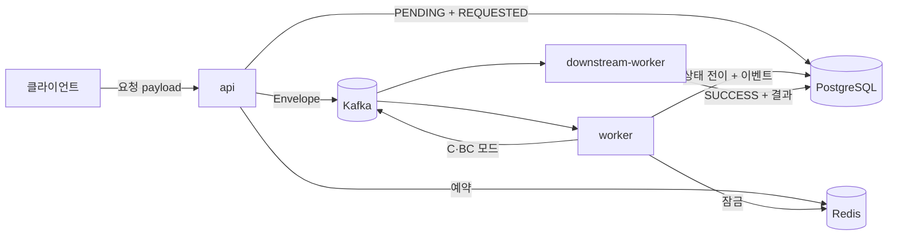

# 데이터 아키텍처

## 문서 목적

데이터 영역의 소유권, 시스템 사이의 흐름, 일관성 및 수명 주기 원칙을 설명합니다. 모든 테이블과 필드를 Markdown으로 복제하지 않습니다.

## 언제 수정하는가

- 데이터 소유자, 기준 저장소 또는 전달 경로가 바뀔 때
- 핵심 불변 조건, 일관성 또는 트랜잭션 정책이 바뀔 때
- 개인정보 분류, 보존 또는 삭제 정책이 달라질 때

## 데이터 소유권

| 데이터 | 기준 저장소 | 쓰기 주체 | 성격 |
|---|---|---|---|
| 작업 상태 (`jobs`) | PostgreSQL | `api`(생성), 워커(상태 전이) | 기준 상태 |
| 작업 이벤트 이력 (`job_events`) | PostgreSQL | `api`, 워커 | 추가 전용 이력 |
| 멱등성 예약 (`idem:req:*`) | Redis | `api` | TTL 기반 임시 데이터 |
| 처리 잠금 (`idem:job:*`) | Redis | 워커 | TTL 기반 임시 데이터 |
| 전달 중 이벤트 | Kafka | `api`, 워커 | 보존 기간 내 재생 가능 |

PostgreSQL이 유일한 기준 저장소입니다. Redis와 Kafka의 데이터는 **모두 유실 가능**하며, 유실 시 중복 처리 위험이 올라가거나 재처리가 필요할 뿐 기준 상태가 훼손되지는 않습니다.

정확한 구조는 [데이터베이스 명세](../specs/database/schema.md)에 있으며, 실제 기준은 `alembic/versions/` 마이그레이션입니다.

## 핵심 불변 조건

- `jobs.id`는 생성 시 부여되며 변경되지 않습니다.
- `job_events.event_id`는 전역 고유합니다. 데이터베이스 유니크 제약으로 강제합니다.
- 상태 전이는 `PENDING → PROCESSING → SUCCESS | FAILED`만 사용합니다. `FAILED`에서 재시도가 성공하면 `SUCCESS`로 전이할 수 있습니다.
- Job 상태 변경과 그 사실을 설명하는 이벤트 기록은 같은 커밋에 포함됩니다.
- `jobs.result`는 완료 시점에만 채워지며, 완료 이후 덮어쓰지 않습니다.

## 데이터 흐름

## 일관성 정책

- 데이터베이스 내부는 강한 일관성을, 데이터베이스와 Kafka 사이는 최종 일관성을 가정합니다.
- 커밋 후 발행 방식이므로 발행 실패 시 Job이 `PENDING`에 고착될 수 있습니다. 아웃박스 도입 검토는 [위험과 기술 부채](risks-technical-debt.md)에 있습니다.
- `jobs.retry_count` 컬럼은 현재 애플리케이션이 갱신하지 않습니다. 재시도 횟수의 실제 기준은 Kafka 메시지의 `retry-count` 헤더입니다.

## 개인정보와 보안

- 현재 저장하는 데이터는 클라이언트가 전달한 추론 입력과 그 결과이며, 개인정보를 전제하지 않습니다.
- `jobs.request_payload`는 클라이언트 입력을 그대로 보관합니다. 개인정보가 포함될 수 있는 입력을 받게 되면 분류·마스킹·보존 정책을 먼저 정의해야 합니다.
- 보존 기간과 삭제 정책은 아직 정의되어 있지 않습니다. `jobs`와 `job_events`는 무기한 증가합니다.

## 관련 문서

- [데이터베이스 명세](../specs/database/README.md)
- [데이터 구조 개요](../specs/database/schema.md)
- [실행 흐름](runtime.md)
- [공통 개념](crosscutting-concepts.md)
