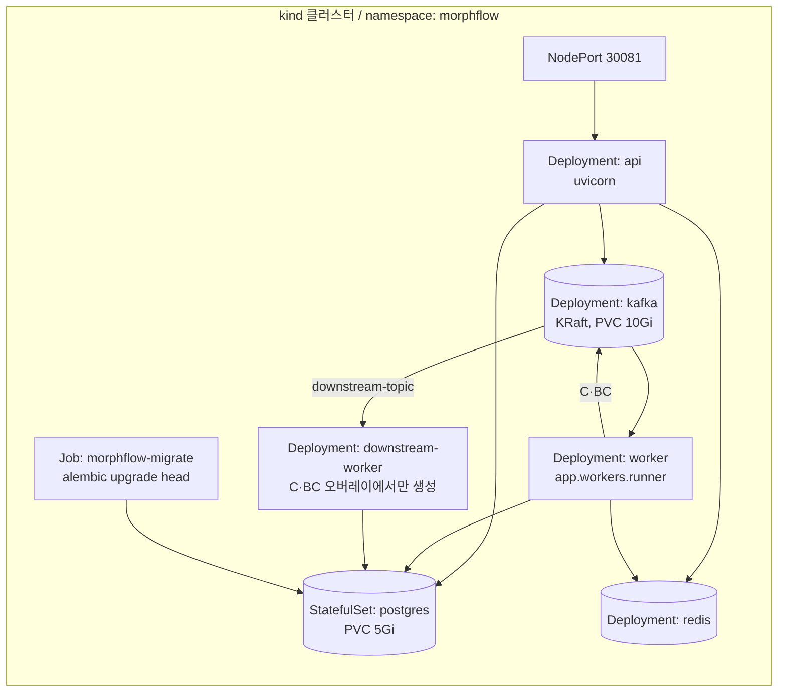

# 배포 구조

## 문서 목적

환경, 실행 노드, 네트워크 경계와 배포 단위의 정적인 구조를 설명합니다. 실제 실행 명령과 승인 절차는 운영 문서에 둡니다.

## 언제 수정하는가

- 환경, 리전, 네트워크 경계 또는 실행 플랫폼이 바뀔 때
- 배포 단위, 복제, 확장 또는 고가용성 방식이 바뀔 때
- 복구 목표나 주요 관리형 서비스가 달라질 때

## 환경

| 환경 | 플랫폼 | 용도 | 진입 경로 |
|---|---|---|---|
| 로컬 Compose | Docker Compose | 기능 개발과 부하 실험 | `http://localhost:8000` |
| 로컬 Kubernetes | kind 단일 노드 | 매니페스트와 기동 순서 검증 | NodePort `30081` → 호스트 `18000` |

두 환경은 **같은 이미지**를 사용하며 설정만 다릅니다. 실행 절차는 [운영 배포 문서](../operations/deployment.md)에 있습니다.

## 배포 단위



| 단위 | 종류 | 복제 | 비고 |
|---|---|---|---|
| `api` | Deployment | HPA 대상 | readiness `/health/ready`, liveness `/health/live` |
| `worker` | Deployment | HPA 대상 | 메트릭 포트 9000 TCP probe |
| `downstream-worker` | Deployment | HPA 대상 | `cmode`·`bcmode` 오버레이에서만 생성 |
| `morphflow-migrate` | Job | 1회 | 기본 배포에서 제외되며 스키마 변경 시에만 실행 |
| `postgres` | StatefulSet | 1 | PVC로 데이터 보존 |
| `redis` | Deployment | 1 | 영속성 요구 없음. 손실 시 멱등성 보호만 일시 약화 |
| `kafka` | Deployment | 1 | KRaft 단일 노드, `Recreate` 전략 |

의존 기동 순서는 `initContainer`가 `postgres`·`redis`·`kafka` 소켓을 확인하는 방식으로 보장합니다.

## Kustomize 구성

```text
deploy/k8s/
├── base/                  기본 A 모드
└── overlays/
    ├── bmode/             WORKER_ROLE=inference
    ├── cmode/             + downstream-worker
    ├── bcmode/            + downstream-worker
    ├── observability/     Prometheus, Grafana, Jaeger, EFK, exporters
    ├── networking/        MetalLB + Envoy Gateway + HTTPRoute
    └── autoscaling-keda/  모드별 lag 기반 ScaledObject
```

모드 전환은 `configmap-app.yaml`의 `ARCHITECTURE_MODE`·`WORKER_ROLE` 패치와 워커 추가로만 이루어지며 이미지는 바뀌지 않습니다.

## 확장과 가용성

- `api`와 워커는 CPU 70%, 메모리 80% 기준 HPA로 확장합니다.
- 컨슈머 처리량은 토픽 파티션 수가 상한입니다. 현재 진입 토픽 파티션은 8이며 `KAFKA_PARTITIONS_WORKER_TOPIC`으로 조정합니다. 파티션보다 많은 워커는 유휴 상태가 됩니다.
- lag 기반 확장이 필요하면 `autoscaling-keda` 오버레이로 CPU 기반 HPA를 대체합니다.
- 상태 저장소는 모두 단일 인스턴스이며 고가용성 구성이 아닙니다. 현재 환경의 의도된 제약입니다.
- PodDisruptionBudget과 NetworkPolicy는 아직 정의되어 있지 않습니다. [위험과 기술 부채](risks-technical-debt.md)에서 추적합니다.

## 관련 문서

- [구성 요소](building-blocks.md)
- [운영 배포 문서](../operations/deployment.md)
- [C4 Container](diagrams/c4/container.md)
- [ADR-0005: Compose에서 Kind로 전환](../decisions/ADR-0005-kind-based-local-kubernetes.md)
