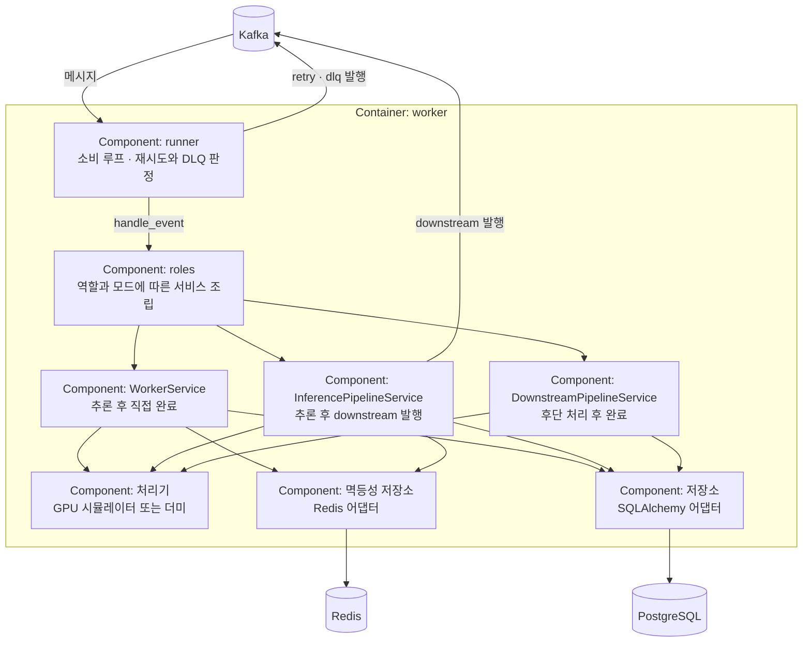

# C4 Component Diagram

## 문서 목적

복잡한 Container 하나의 내부 주요 구성 요소와 상호작용을 선택적으로 보여줍니다. 코드 클래스나 함수 수준은 다루지 않습니다.

## 언제 수정하는가

선택한 Container의 주요 책임 분리, 내부 인터페이스 또는 의존 방향이 바뀔 때 수정합니다. 단순한 Container에는 이 문서를 작성하지 않아도 됩니다.

## 대상

`worker` Container를 대상으로 합니다. 역할과 아키텍처 모드에 따라 내부 조립이 달라지는 유일한 실행 단위이기 때문입니다. `api`는 구조가 단순해 Component 수준 문서를 두지 않습니다.

## 다이어그램

## 책임 경계

| Component | 책임 | 하지 않는 것 |
|---|---|---|
| `runner` | 소비, 오프셋 커밋, 재시도 횟수와 DLQ 판정 | 업무 규칙 판단 |
| `roles` | 설정에 따른 서비스 선택과 조립 | 처리 로직 직접 수행 |
| `*Service` | 상태 전이, 이벤트 기록, 멱등성 적용 | Kafka 소비, 오프셋 관리 |
| 어댑터 | 외부 시스템 접근 | 업무 규칙 |

역할별 서비스 선택 규칙은 [구성 요소](../../building-blocks.md)의 조립 표에 있습니다.

## 관련 문서

- [구성 요소](../../building-blocks.md)
- [실행 흐름](../../runtime.md)
- [C4 안내](README.md)
