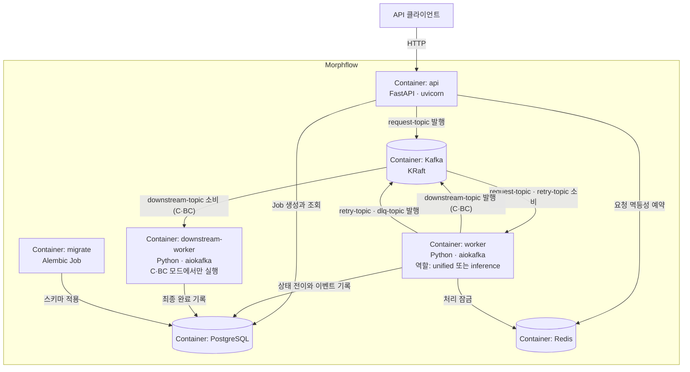

# C4 Container Diagram

## 문서 목적

시스템 내부의 주요 실행·배포 단위와 데이터 저장소, 외부 관계를 보여줍니다. 각 단위의 책임은 [구성 요소](../../building-blocks.md)에 기록합니다.

## 언제 수정하는가

Container를 추가·분리·통합하거나 주요 통신 관계 또는 기술 경계가 바뀔 때 수정합니다.

## 다이어그램

## 구성 요소 요약

| Container | 기술 | 책임 |
|---|---|---|
| `api` | FastAPI, uvicorn | 요청 검증, Job 생성, 상태 조회, 상태 확인 |
| `worker` | Python, aiokafka | 진입 토픽 소비, 추론, 재시도·DLQ 판정 |
| `downstream-worker` | Python, aiokafka | 후단 처리와 최종 완료 |
| `migrate` | Alembic | 스키마 적용 |
| Kafka | KRaft 단일 노드 | 단계 간 이벤트 전달과 완충 |
| PostgreSQL | 16 | 기준 상태 저장 |
| Redis | 7 | 멱등성 예약과 처리 잠금 |

`worker`와 `downstream-worker`는 같은 이미지이며 `WORKER_ROLE`로 구분됩니다.

## 관련 문서

- [구성 요소](../../building-blocks.md)
- [배포 구조](../../deployment.md)
- [C4 안내](README.md)
