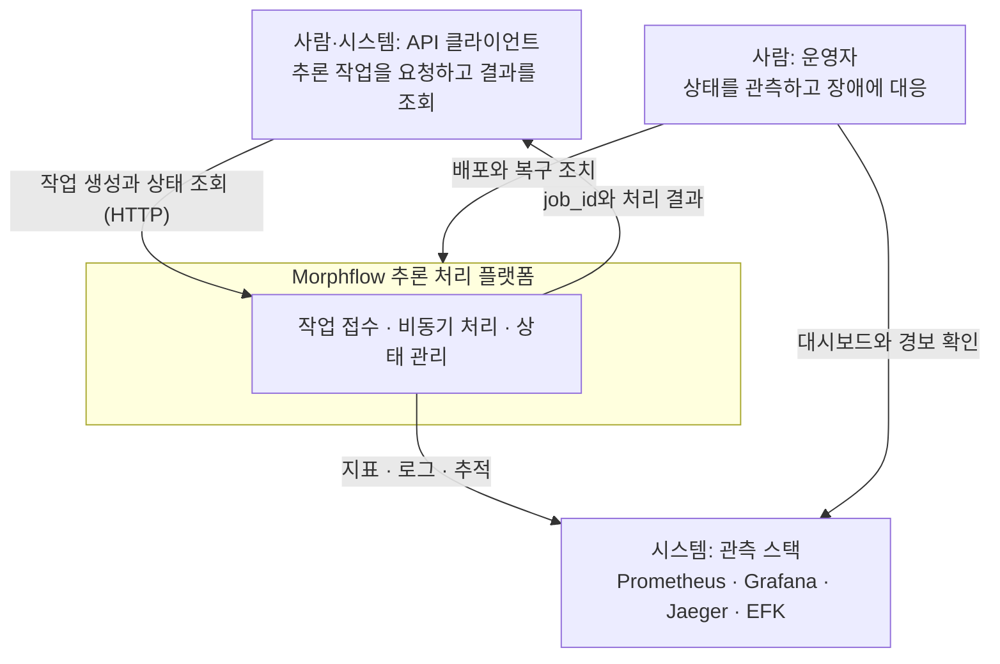

# C4 System Context

## 문서 목적

시스템과 사용자, 외부 시스템의 관계를 한눈에 보여줍니다. 관계의 상세 의미는 [시스템 맥락](../../context.md)에 기록합니다.

## 언제 수정하는가

시스템 경계, 주요 사용자 또는 외부 시스템 관계가 바뀔 때 수정합니다.

## 다이어그램

## 범례

| 표기 | 의미 |
|---|---|
| 사각형 | 사람 또는 외부 시스템 |
| 굵은 경계 영역 | 이 문서가 설명하는 시스템의 경계 |
| 화살표 | 통신 방향과 목적 |

PostgreSQL, Redis, Kafka는 시스템 경계 **안쪽**의 구성 요소이므로 이 수준에서는 표현하지 않습니다. [C4 Container](container.md)를 참조합니다.

## 관련 문서

- [시스템 맥락](../../context.md)
- [C4 Container](container.md)
- [C4 안내](README.md)
