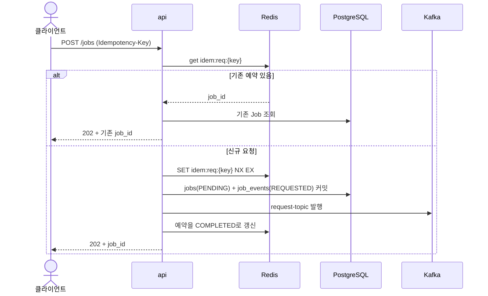
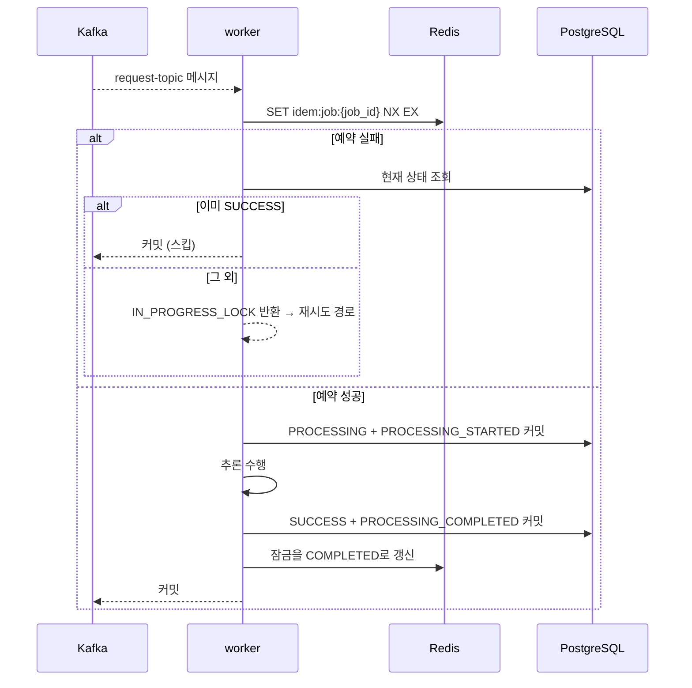
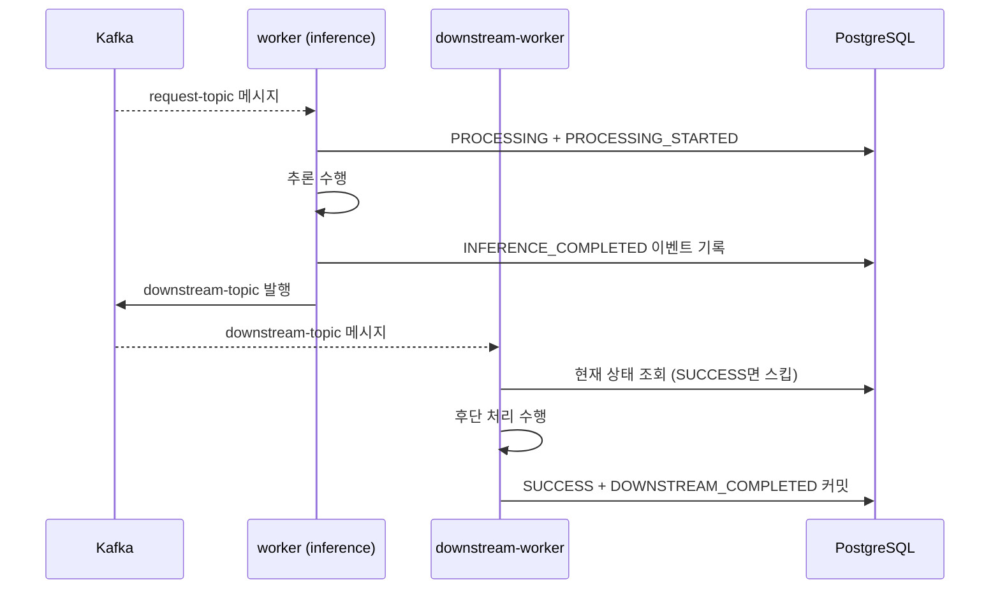
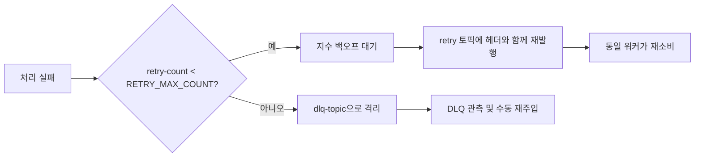

# 실행 흐름

## 문서 목적

정적인 구성 요소 목록만으로 알기 어려운 핵심 시나리오의 호출 순서, 상태 변화, 오류와 복구 동작을 설명합니다.

## 언제 수정하는가

- 핵심 시나리오의 처리 순서가 바뀔 때
- 재시도, 시간 초과, 중복 처리 또는 트랜잭션 경계가 바뀔 때
- 새로운 비동기 흐름이나 중요한 실패 경로가 생길 때

## 작업 생성 (모든 모드 공통)

응답은 항상 `202 Accepted`이며 처리 완료를 의미하지 않습니다. 결과는 `GET /jobs/{job_id}`로 조회합니다.

## 작업 처리 (A·B 모드)

## 작업 처리 (C·BC 모드)

추론 워커는 완료 상태를 기록하지 않고 `downstream-topic`으로 넘깁니다. 최종 완료는 downstream 워커가 담당합니다.

C·BC 모드에서 Job은 추론 완료 시점에도 `PROCESSING` 상태로 남습니다. 추론 완료 사실은 `job_events`의 `INFERENCE_COMPLETED`로만 관측할 수 있습니다. 별도 상태값 도입은 [RFC-0001](../rfcs/RFC-0001-extended-job-status-model.md)에서 검토 중입니다.

## 오류와 복구

처리가 실패하면 Job을 `FAILED`로 기록하고 Redis 잠금을 삭제한 뒤 재시도 판정으로 넘어갑니다. 잠금을 삭제하기 때문에 재시도가 다시 처리할 수 있고, 재시도가 성공하면 상태는 `SUCCESS`로 덮어써지며 오류 메시지는 지워집니다.

- 재시도 헤더: `retry-count`, `original-topic`, `error-reason`
- 백오프: `RETRY_BACKOFF_SECONDS`에서 시작해 `RETRY_BACKOFF_MULTIPLIER`배씩 증가하며 `RETRY_BACKOFF_MAX_SECONDS`에서 상한
- 재시도 토픽은 역할별로 분리됩니다. `original-topic`이 자신의 소비 토픽과 다르면 해당 메시지를 건너뜁니다.
- 잠금 경합(`IN_PROGRESS_LOCK`)도 현재는 처리 실패와 동일하게 재시도 횟수를 소모합니다. 알려진 한계로 [위험과 기술 부채](risks-technical-debt.md)에 기록되어 있습니다.

운영자에게는 `dlq_messages_total` 증가와 `DlqMessagesDetected` 경보로 노출되며, 대응 절차는 [재시도·DLQ 급증 런북](../operations/runbooks/RUNBOOK-retry-dlq-surge.md)에 있습니다.

## 일관성과 트랜잭션

- 트랜잭션 경계는 **세션 단위**이며 Job 상태 변경과 이벤트 기록을 같은 커밋에 묶습니다.
- 데이터베이스 커밋과 Kafka 발행은 **하나의 트랜잭션이 아닙니다.** 커밋 후 발행이 실패하면 Job이 `PENDING`으로 남습니다. 알려진 한계로 [위험과 기술 부채](risks-technical-debt.md)에서 추적합니다.
- 전달 보장은 at-least-once입니다. 오프셋은 폴링 배치의 모든 메시지를 처리한 뒤 커밋하며, 하나라도 예외로 실패하면 배치 전체를 커밋하지 않습니다.
- 중복 소비 시 재처리를 막는 것은 Redis 잠금과 데이터베이스 상태 확인의 조합입니다. 자세한 내용은 [공통 개념](crosscutting-concepts.md)에 있습니다.

## 관련 문서

- [구성 요소](building-blocks.md)
- [공통 개념](crosscutting-concepts.md)
- [API 명세](../specs/api/README.md)
- [이벤트 명세](../specs/events/README.md)
- [운영 안내](../operations/README.md)
