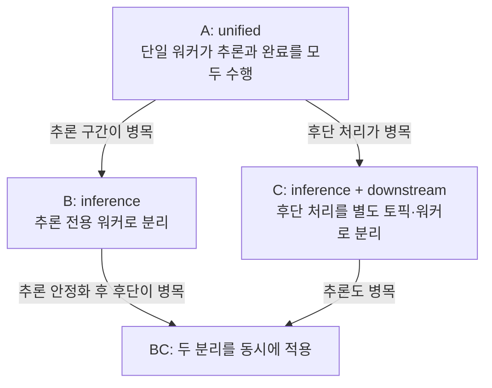

# 해결 전략

## 문서 목적

핵심 품질 목표와 제약을 만족하기 위한 상위 수준의 기술·구조적 접근을 요약합니다. 세부 구성 요소나 결정 이력을 반복하지 않습니다.

## 언제 수정하는가

- 시스템의 핵심 품질 목표나 주요 제약이 달라질 때
- 전체 구조, 통합 방식 또는 데이터 전략이 크게 바뀔 때
- 새로운 ADR이 기존 전략을 대체할 때

## 핵심 전략

| 품질 목표 | 전략 | 근거 |
|---|---|---|
| 처리 지연이 API 응답에 전파되지 않을 것 | 요청 접수와 처리를 Kafka로 분리하고 API는 즉시 `202`로 응답 | [ADR-0001](../decisions/ADR-0001-transitional-architecture-modes.md) |
| 병목 구간만 선택적으로 분리할 것 | 하나의 코드베이스에서 워커 역할을 설정으로 전환(A/B/C/BC) | [ADR-0001](../decisions/ADR-0001-transitional-architecture-modes.md) |
| 재처리에도 결과가 한 번만 반영될 것 | Redis 예약을 1차 방어, 데이터베이스 상태 확인을 2차 방어로 사용 | [ADR-0002](../decisions/ADR-0002-idempotency-strategy.md) |
| 실패가 파이프라인을 막지 않을 것 | 헤더 기반 재시도 후 DLQ로 격리 | [ADR-0003](../decisions/ADR-0003-retry-and-dlq.md) |
| 전환 판단을 감이 아니라 데이터로 할 것 | 단계별 지표를 분리 계측하고 전환 임계치를 지표로 정의 | [품질](quality.md) |

## 전환형 아키텍처

A/B/C는 서로 다른 시스템이 아니라 같은 서비스의 운영 모드입니다. 기본값은 A이고, 관측된 병목 위치에 따라 B 또는 C로, 필요하면 BC로 진화합니다.



| 모드 | 워커 구성 | 완료 지점 |
|---|---|---|
| A | `unified` 1종 | 워커가 직접 `SUCCESS` 기록 |
| B | `inference` 1종 | 워커가 직접 `SUCCESS` 기록 |
| C | `inference` + `downstream` | downstream 워커가 `SUCCESS` 기록 |
| BC | `inference` + `downstream` | downstream 워커가 `SUCCESS` 기록 |

모드는 `ARCHITECTURE_MODE`, 역할은 `WORKER_ROLE` 환경 변수로 지정합니다. 실제 조립은 `app/workers/roles.py`의 `build_worker_role()`에서 이루어집니다.

> B 모드는 현재 A 모드와 같은 처리 경로(`WorkerService`)를 사용하며, 배포 단위와 관측 라벨만 분리됩니다. 추론 전용 처리 경로가 실제로 갈라지는 것은 C와 BC입니다.

## 전환 판단 기준

전환은 아래 지표가 지속될 때 검토합니다. 임계치와 측정 결과는 [품질](quality.md)에 있습니다.

- **A → B**: `job_processing_seconds` p95 상승 + `request-topic` lag 누적 + 처리 시간의 대부분이 추론 구간에 집중
- **A/B → C**: 추론 완료 이후 완료까지의 지연 증가, 데이터베이스·외부 연동 지연 증가
- **→ BC**: 추론을 분리한 뒤에도 후단 지표만 악화될 때

## 계층 구조

의존 방향은 바깥에서 안으로만 향합니다. `domain`은 어떤 외부 기술도 알지 못하며, `application`은 `ports`의 인터페이스에만 의존합니다.

```text
api / workers  →  application  →  ports  ←  adapters
                                    ↑
                                 domain
```

이 구조 덕분에 테스트는 Kafka·Redis·PostgreSQL 없이 인메모리 구현을 주입해 실행됩니다.

## 관련 문서

- [구성 요소](building-blocks.md)
- [실행 흐름](runtime.md)
- [품질](quality.md)
- [ADR](../decisions/README.md)
