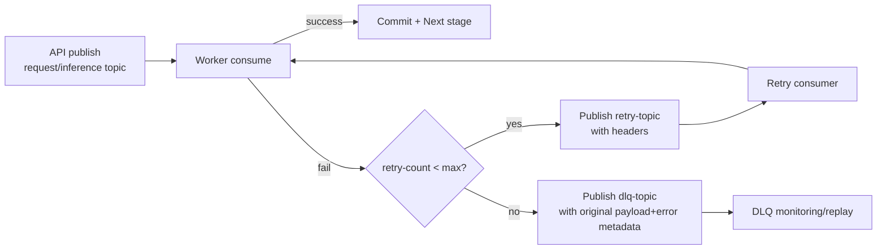

# 운영/아키텍처 최종 정리 패키지 (2026-03-10)

## 1. 문서 목적
이 문서는 현재 구현된 A/B/C 아키텍처, Observability, Retry/DLQ를 운영 관점에서 최종 정리한 패키지 문서다.

---

## 2. A/B/C 아키텍처 비교

| 구분 | A (기본) | B (추론 병목 분리) | C (다운스트림 병목 분리) |
|---|---|---|---|
| API 발행 topic | `request-topic` | `inference-topic` | `inference-topic` |
| 주요 worker | `unified` | `inference` | `inference` + `downstream` |
| 처리 흐름 | API -> request -> unified -> DB | API -> inference -> inference worker -> DB | API -> inference -> inference worker -> downstream-topic -> downstream worker -> DB |
| 병목 위치 | 단일 worker 내부 혼합 병목 | 추론/GPU 구간 | 저장/전달/후처리 구간 |
| 운영 장점 | 단순, 빠른 배포 | 추론 자원 제어/분리 | 후단 장애 격리, 파이프라인 분리 |
| 리스크 | lag 누적 시 전구간 영향 | inference lag 누적 | downstream lag 누적 |

### 전환 기준 (Metric 기반)
- A -> B
  - `job_processing_seconds` p95 증가
  - inference lag 증가 (`architecture-a-worker-inference`)
  - GPU util/추론 지연 상승
- A/B -> C
  - inference 후 완료 지연 증가
  - downstream lag 증가 (`architecture-a-worker-downstream`)
  - DB/외부 연동 지연 증가

---

## 3. Observability 구조

### 스택
- Metrics: Prometheus
- Dashboard: Grafana
- Logs: Fluent Bit -> Elasticsearch -> Kibana (EFK)

### 수집 대상
- API `/metrics`
- Worker metrics (unified/inference/downstream)
- Kafka consumer lag (`kafka-exporter`)
- Redis metrics (`redis-exporter`)
- Postgres metrics (`postgres-exporter`)
- Container stdout logs (api/worker/kafka/redis/postgres)

### Alert Rule 구조 (핵심)
- Availability
  - `ApiDown`, `WorkerDown`, `KafkaExporterDown`, `RedisExporterDown`, `PostgresExporterDown`
- Queue/Processing
  - `KafkaConsumerLagHigh`
  - `DownstreamConsumerLagHigh`
  - `WorkerProcessingTimeHigh`
  - `DownstreamProcessingTimeHigh`
  - `InferenceConcurrencySaturated`
- Reliability
  - `DlqMessagesDetected`
- Storage
  - `PostgresResponseSlow`

---

## 4. Retry / DLQ 흐름

### Topic
- `request-topic`
- `retry-topic`
- `dlq-topic`

### Header
- `retry-count`
- `original-topic`
- `error-reason`

### 다이어그램

### 정책 요약
- exponential backoff 적용
- max retry 초과 시 DLQ 격리
- 원본 payload 유지
- DLQ replay는 원인 수정 후 선택적 재주입

---

## 5. 운영 Runbook 요약

### Kafka lag 급증
1. exporter/target `up` 확인
2. worker scale-out
3. lag 감소 추세 확인

### Worker 지연
1. 최근 배포/설정 변경 확인
2. 리소스/동시성 점검
3. p95 회복 확인

### Redis 장애
1. Redis 연결 복구
2. 멱등성 영향 구간 확인
3. 중복 처리 검증

### DLQ 운영
1. `dlq_messages_total` 증가 감지
2. `error-reason`으로 유형 분류
3. 원인 수정 후 샘플 replay
4. 배치 replay 및 안정화 확인

---

## 6. 현재 구현 상태 (요약)
- A: 실행/부하 검증 완료
- B: inference worker + simulator + 관측 지표 검증 완료
- C: inference -> downstream 분리 최소 동작/시나리오 검증 완료
- Retry/DLQ: 헤더/백오프/DLQ 격리/지표/알람 반영 완료
- Observability: Prometheus/Grafana/EFK + exporter/alert 구성 완료

