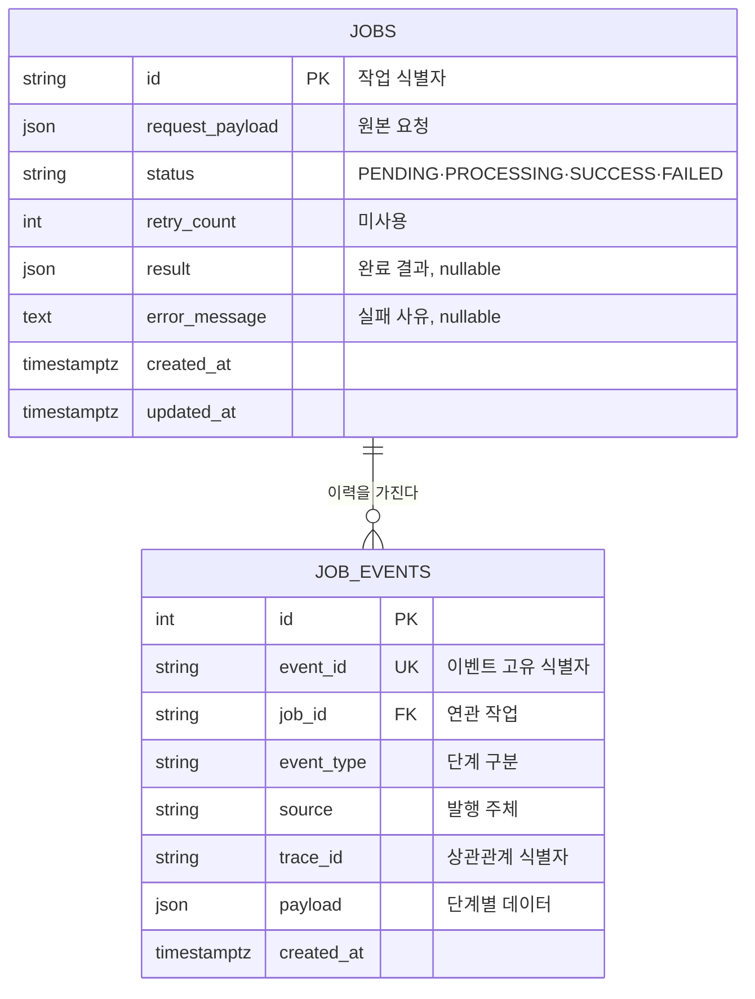

# 데이터 구조 개요

## 기준 위치

- 마이그레이션 경로: `alembic/versions/`
- 스키마 적용 명령: `alembic upgrade head`
- 되돌리기 명령: `alembic downgrade -1`
- 드리프트 검증 명령: `alembic check` (CI의 `migration-check` 작업에서 실행)

ORM 모델(`app/adapters/db/models.py`)과 마이그레이션이 어긋나면 CI가 실패합니다. **실제 구조의 기준은 마이그레이션입니다.**

## 영역 관계

`job_events.job_id`는 **외래 키 제약이 없습니다.** 인덱스만 존재하며 논리적 참조 관계입니다.

## 인덱스

| 테이블 | 인덱스 | 목적 |
|---|---|---|
| `jobs` | `ix_jobs_status` | 상태별 조회 |
| `job_events` | `uq_job_events_event_id` | 이벤트 중복 기록 방지 |
| `job_events` | `ix_job_events_job_id` | 작업별 이력 조회 |
| `job_events` | `ix_job_events_event_type` | 단계별 조회 |
| `job_events` | `ix_job_events_trace_id` | 상관관계 추적 |

## 쓰기 주체

| 테이블 | 생성 | 갱신 |
|---|---|---|
| `jobs` | `api` | 워커 (상태·결과·오류) |
| `job_events` | `api`, 워커 | 없음 (추가 전용) |

## 마이그레이션 정책

- 스키마 변경은 Alembic 마이그레이션으로만 수행하며 ORM 모델 변경만으로 반영하지 않습니다.
- Kubernetes 환경에서는 `morphflow-migrate` Job이 애플리케이션보다 먼저 실행됩니다. 기본 배포에는 포함되지 않으므로 스키마 변경 시 `scripts/k8s-deploy-kind.sh <cluster> <overlay> --with-migrate`로 실행합니다.
- Compose 환경에서는 `migrate` 서비스가 `service_completed_successfully` 조건으로 선행됩니다.
- 컬럼 삭제와 타입 변경은 애플리케이션 배포와 순서를 나누어 적용해야 합니다. 현재 그런 변경 이력은 없습니다.

## 관련 문서

- [데이터 아키텍처](../../architecture/data.md)
- [데이터 사전](data-dictionary.md)
